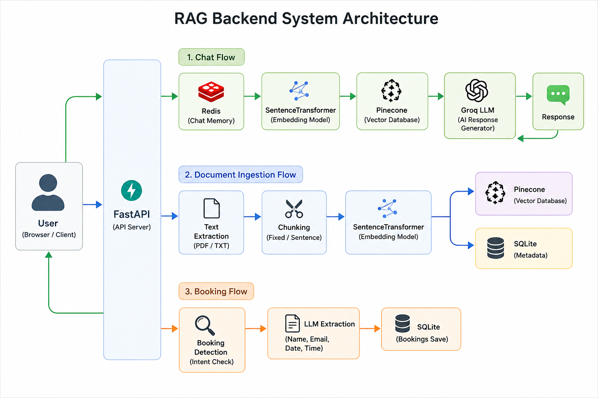

# 🚀 RAG Backend Project (FastAPI + Redis + Pinecone)

## 📌 Overview
This project is a Retrieval-Augmented Generation (RAG) backend system built using FastAPI.

It allows users to:
- Upload documents (PDF/TXT)
- Ask questions based on uploaded content using LLMs
- Maintain multi-turn conversations
- Book interviews using AI-based extraction

---

## 🏗️ Architecture



This system follows a Retrieval-Augmented Generation (RAG) pipeline. Documents are processed, chunked, converted into embeddings using SentenceTransformer, and stored in Pinecone for semantic search. When a user asks a question, relevant chunks are retrieved from Pinecone, combined with chat history stored in Redis, and sent to the Groq LLM to generate a context-aware response. The system also supports interview booking by extracting booking details from user messages and storing them in SQLite.

---

## ✨ Features

### 📄 1. Document Ingestion API
- Upload PDF / TXT files
- Extract text from documents
- Chunking strategies:
  - Fixed-size chunking
  - Sentence-based chunking
- Generate embeddings using SentenceTransformer
- Store embeddings in Pinecone vector database
- Store metadata in SQLite

---

### 💬 2. Conversational RAG API
- Uses Pinecone for semantic similarity search
- Redis for chat memory (multi-turn conversations)
- Groq LLM for response generation
- Context-aware answers based on retrieved chunks + history

---

### 📅 3. Interview Booking System
- Extracts booking details from user input using LLM
- Stores:
  - Name
  - Email
  - Date
  - Time
- Saves booking data in SQLite database

---

## 🧠 Tech Stack
- FastAPI
- Python
- Pinecone (Vector Database)
- Redis (Memory Store)
- SentenceTransformers (Embeddings)
- SQLite (Metadata + Bookings)
- Groq LLM API
- Docker + Docker Compose

---

## ⚙️ How to Run

### 🐳 Using Docker (Recommended)
```bash
docker-compose up --build
```


## 📡 API Documentation

After running the project, open Swagger UI:

```text
http://localhost:8000/docs
```

---

## 🎯 What I Learned

- Built an end-to-end RAG pipeline
- Implemented semantic search using vector embeddings
- Integrated Pinecone for vector storage and retrieval
- Used Redis for multi-turn conversation memory
- Applied prompt engineering for context-aware responses
- Developed REST APIs using FastAPI